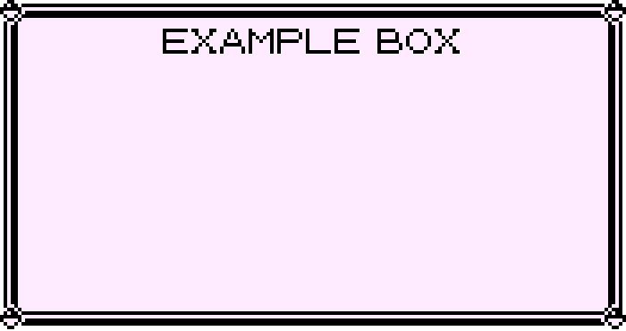
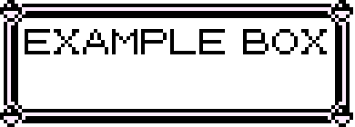

# Pokémon Stream Overlay

## Overlay
This can be used to generate a stream overlay. There's a file called `config.json`, which can be used to generate the
overlay. If this file is present, it will be used. If this file doesn't exist, you'll get asked a few things to generate
retro looking boxes like this:




These can be used for game frames, chat boxes, webcam frames, or other special stuff you can imagine.

The `config.json` file does automatically generate a big image with multiple boxes included. The config requires the
following:
- `size` - an array with two integers [width, height]
- `panels` - an array of objects to define the boxes, see below

Configuring the panels, italic means optional:

| Key        | Value                                                                               |
|------------|-------------------------------------------------------------------------------------|
| `pos`      | The [x, y] where to generate on the main image                                      |
| `size`     | Same as `size` in main image                                                        |
| *`title`*  | *The title, written on top of the box*                                              |
| *`filled`* | *`True`/`False` for defining if a white background should be generated, default on* |

For more information on how to use it, see the existing `config.json`.

## Channel rewards
If you want the bottom left Pokémon being controlled by the chat, you can add a `secret.json` file which includes the
following:
```json
{
  "token": "oauth:YOUR_TWITCH_TOKEN",
  "channel": "CHANNEL_WHERE_TO_LISTEN",
  "reward-id": "YOUR_REWARD_ID"
}
```

The users need to write a number between 1 and 151, the Pokémon on this Pokédex entry will be downloaded and printed.
You need to run this script for users using this reward.

## Known problems
- Only uppercase characters working
- Out of bounds exception for too long titles
- Reward not configurable (for which Pokémon are allowed)
- Some things, like the Pokémon, logo, and slots are not configurable
